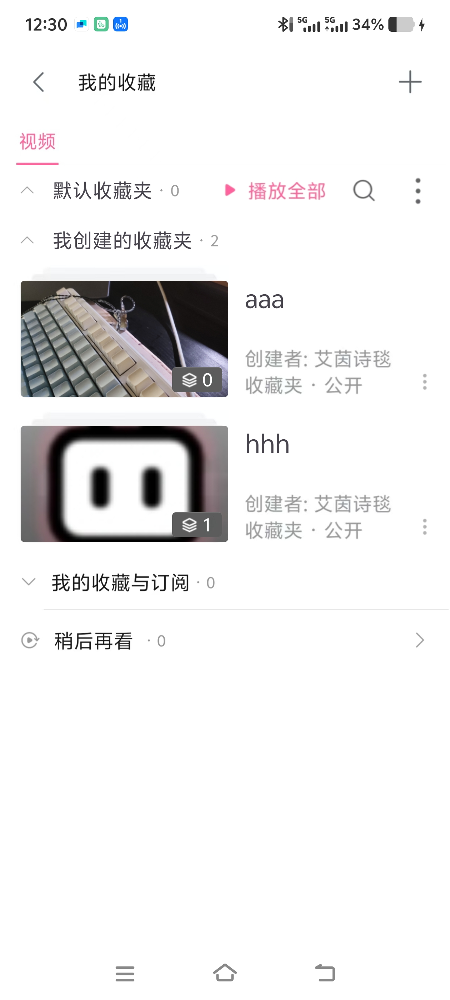

## 💡 项目简介

本项目是一个仿哔哩哔哩的 Android 应用，实现了视频播放、推荐视频展示、用户收藏等核心功能，提供了类似哔哩哔哩的视频浏览和交互体验。

## 🔧 技术栈

- 开发语言 / 框架：Java、Android SDK、AndroidX
- 使用的工具或库：
  - Retrofit + OkHttp：网络请求
  - Glide：图片加载
  - RecyclerView：列表展示
  - SQLite 数据库：收藏数据本地存储
  - ConstraintLayout：界面布局
  - Material Design：UI 组件

## 🖼️ 页面展示

  

- 首页：展示推荐视频列表，包含视频缩略图、标题等信息

    

- 视频详情页：实现视频播放功能，包含播放控制、进度条、相关推荐等

    

- 收藏页：展示用户收藏的视频文件夹，支持文件夹管理和视频查看

## 📁 功能模块说明

- 首页模块：
  - 功能：展示推荐视频列表，支持底部导航切换不同栏目
  - 实现说明：使用 BottomNavigationView 实现底部导航，通过 Fragment 切换不同页面内容，采用 RecyclerView 展示视频列表
- 视频播放模块：
  - 功能：视频播放、暂停、进度调整、全屏播放等控制
  - 实现说明：使用 VideoView 作为视频播放核心组件，自定义播放控制器，通过 Handler 实现进度更新和控制栏自动隐藏
- 收藏模块：
  - 功能：视频收藏、取消收藏、收藏夹管理
  - 存储逻辑：使用 SQLite 数据库存储收藏信息，通过 FavoriteDatabaseHelper 管理数据 CRUD 操作
  - 状态管理：通过接口回调更新收藏状态，实时刷新 UI 展示
- 推荐视频模块：
  - 功能：在视频详情页展示相关推荐视频
  - 实现说明：使用 RecyclerView 多类型布局，区分不同内容区域，点击推荐视频可跳转到对应视频详情页

## 🚧 项目收获与挑战

- 学到的知识 / 突破的问题：
  - 掌握了 VideoView 的高级用法，解决了视频进度同步和全屏切换的状态保持问题
  - 实现了 RecyclerView 多类型布局，优化了复杂列表的展示逻辑
  - 学会了使用 SQLite 进行本地数据持久化，处理了数据增删改查的边界情况
- 对 UI、架构、性能方面的提升：
  - UI：采用 Material Design 设计规范，统一了应用视觉风格，实现了流畅的交互体验
  - 架构：使用 BaseActivity 封装公共逻辑，采用 MVP 思想分离视图与数据处理
  - 性能：对图片加载进行了缓存优化，对数据库操作进行了线程管理，提升了应用响应速度

